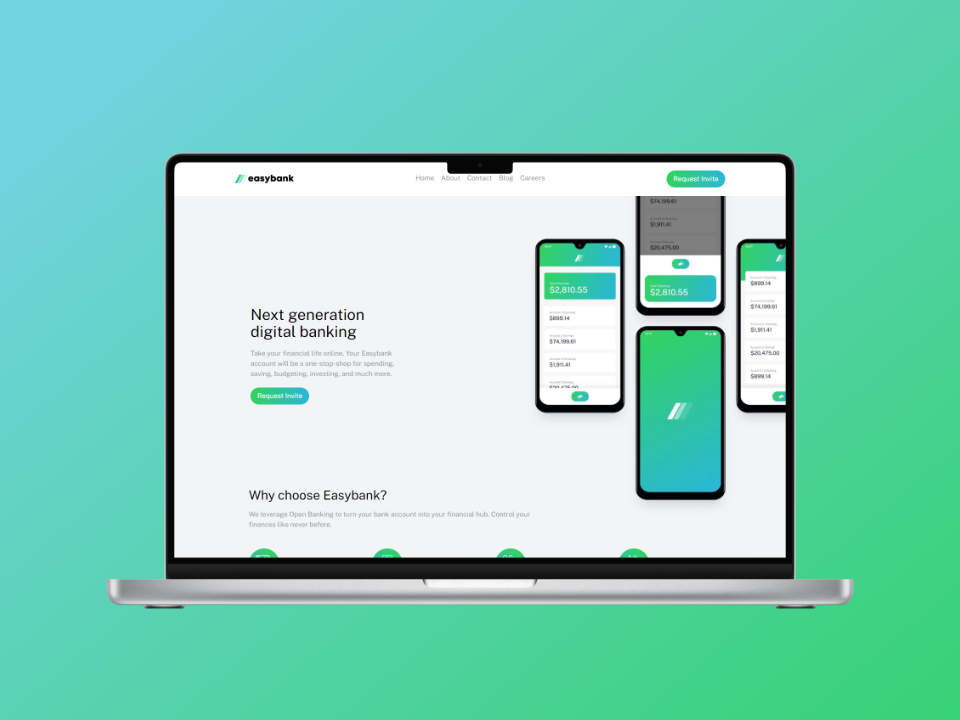
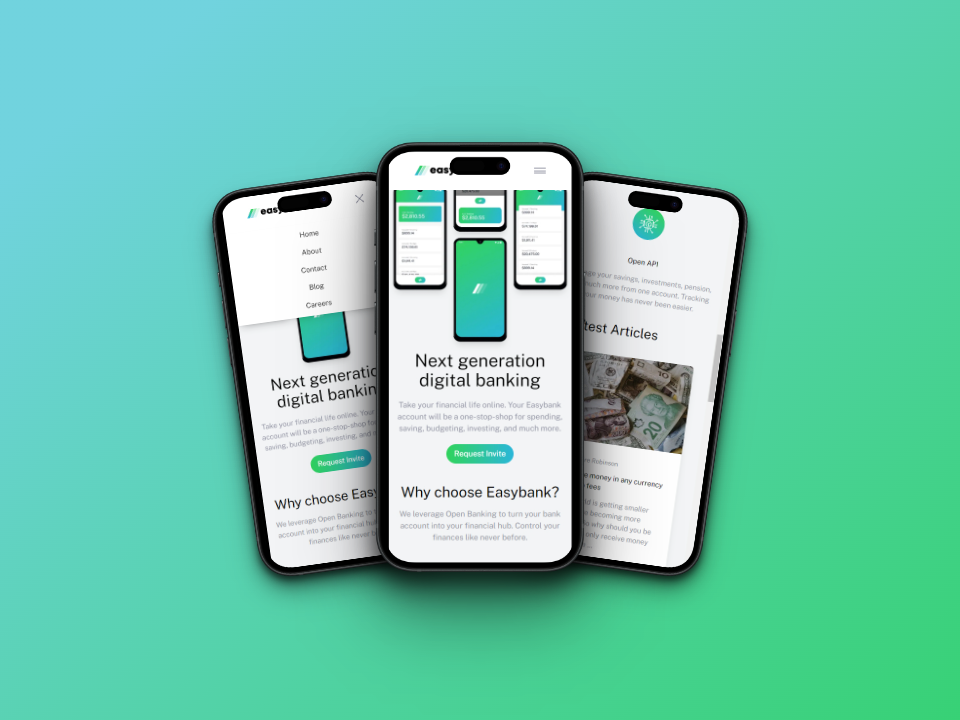

# Frontend Mentor - Easybank landing page solution

This is a solution to the [Easybank landing page challenge on Frontend Mentor](https://www.frontendmentor.io/challenges/easybank-landing-page-WaUhkoDN). Frontend Mentor challenges help you improve your coding skills by building realistic projects.

## Table of contents

- [Overview](#overview)
  - [The challenge](#the-challenge)
  - [Screenshot](#screenshot)
  - [Links](#links)
- [My process](#my-process)
  - [Built with](#built-with)
- [Author](#author)
- [Run Locally](#run-locally)

## Overview

### The challenge

Users should be able to:

- View the optimal layout for the site depending on their device's screen size
- See hover states for all interactive elements on the page

### Screenshot






### Links

- Live Site URL: [EasyBankApp](https://easybank-app-emanuelra94.netlify.app/)

## My process

### Built with

- Semantic HTML5 markup
- CSS custom properties
- Flexbox
- CSS Grid
- [Astro](https://astro.build/) - Framework
- [React](https://reactjs.org/) - JS library
- [Tailwind](https://tailwindcss.com/) - For styles

## Author

- Github - [emanuel-ra](https://github.com/emanuel-ra/)
- Frontend Mentor - [@emanuel-ra](https://www.frontendmentor.io/profile/emanuel-ra)
- Linkedin - [@emanuelramirezabarca](https://www.linkedin.com/in/emanuelramirezabarca/)

## Run Locally

Clone the project

```bash
  git clone git@github.com:emanuel-ra/E-commerce-product-page---Astro.git
```

Go to the project directory

```bash
  cd app
```

Install dependencies

```bash
pnpm install
```

Start the server

```bash
pnpm run dev
```
